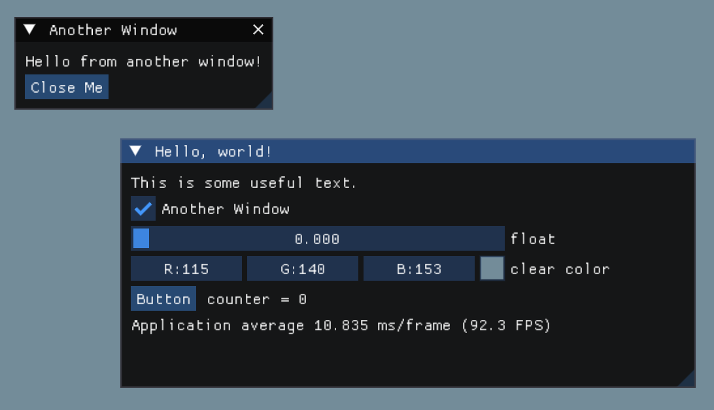

# Dear ImGui via CMake

Minimal GUI app that automatically pulls [Dear ImGui](https://github.com/ocornut/imgui) via CMake `FetchContent`. Build with:

```sh
mkdir build
cmake -B build
cmake --build build
```

See `imgui/CMakeLists.txt` for reference. For now this is hardcoded to the GLFW backend. `main.cpp` is a cut-down version of the GLFW example in the Dear ImGui repo.


